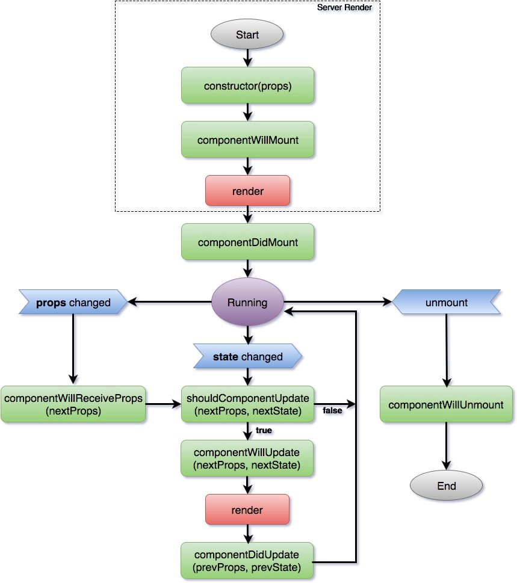

# Ciclo de vida
En React, un componente tiene lo que se conoce como un ciclo de vida. Al igual que los seres vivos, que nacen, crecen, se desarrollan y mueren, un componente se monta (nace), se actualiza (crece), y se desmonta (muere). Montar se refiere a que un componente se agrega al DOM.

Cada ciclo de vida de un componente tiene un método propio que le corresponde y que se ejecuta cuando el componente llega a esa etapa. Los métodos de ciclos de vida sólo pueden ser accedidos y utilizados en un componente de clase, que es otra de las ventajas que tiene sobre los componentes funcionales.

Muchos de estos métodos rara vez los utilizamos, pero es importante saber que existen por si en alguna ocasión necesitamos hacer uso de ellos. La lista de métodos son:

## Montado
constructor()<br>
componentWillMount()<br>
render()<br>
componentDidMount()
## Actualización
componentWillReceiveProps()<br>
shouldComponentUpdate()<br>
componentWillUpdate()<br>
render()<br>
componentDidUpdate()<br>
### Desmontado
componentWillUnmount()

#Diagrama de flujo del ciclo de vida de un componente



# constructor
Este método es invocado cuando el componente está siendo creado y antes de ser montado (de ser agregado al DOM). Su función primaria es inicializar estado.
``` 
class Clicker extends React.Component {
  constructor(props) {
    super(props);
    this.state = {
       clicks: 0
    };
  }
  handleClick = () => {
    this.setState({ 
      clicks: this.state.clicks + 1
    });
  }
  //...
}
``` 
De todas formas, con la nueva sintaxis de JS llamada propiedades de clase, podemos evitar declarar el constructor para inicializar estado:

``` 
class Clicker extends React.Component {
  state = {
       clicks: 0
  }
  handleClick = () => {
    this.setState({ 
      clicks: this.state.clicks + 1
    });
  }
  //...
}
``` 

## componentWillMount
Este método se ejecuta inmediatamente antes de que un componente es agregado al DOM / renderizado. Se incluye por cuestiones de retrocompatibilidad (para que las versiones viejas de React sigan funcionando), pero no deberíamos tener que utilizarlo nunca, además de que no tiene demasiada utilidad porque el componente todavía no existe en el DOM, por lo tanto no podemos cambios de estado.

## render
El ciclo de vida más utilizado, ya que lo requiere obligatoriamente todo componente de clase. Controla el renderizado de un componente durante la fase de montado y actualización. No se puede cambiar el estado en este método.
